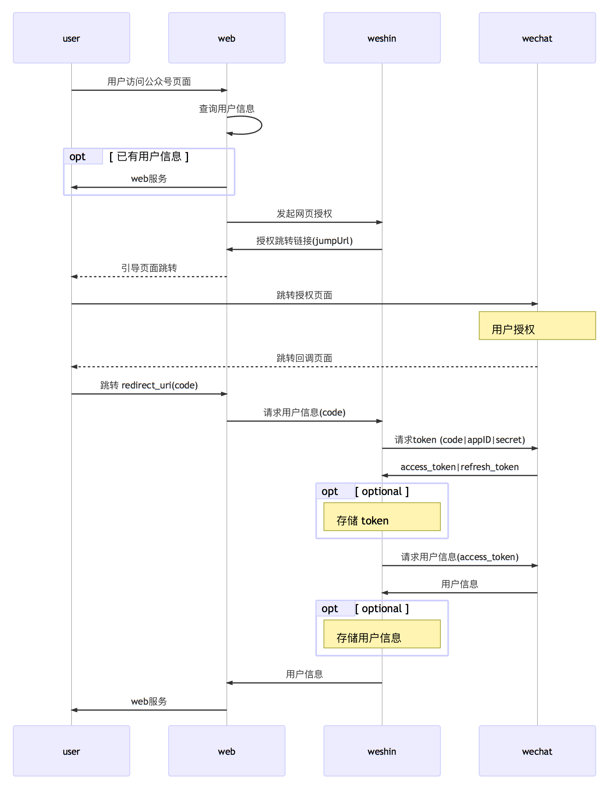

# weshin

A WeChat openAPI wrapper for **Go**

## 功能

### 微信公众号基础功能

- [获取 access_token](https://mp.weixin.qq.com/wiki?t=resource/res_main&id=mp1421140183)
- [响应微信服务器校验请求](https://mp.weixin.qq.com/wiki?t=resource/res_main&id=mp1421135319)
- [获取已授权用户信息](https://mp.weixin.qq.com/wiki?t=resource/res_main&id=mp1421140839)

### 微信网页开发

- 微信网页授权
[微信网页授权流程](https://mp.weixin.qq.com/wiki?t=resource/res_main&id=mp1421140842)

- 微信 JSAPI_TICKET

### 第三方平台授权

[授权流程技术说明](https://open.weixin.qq.com/cgi-bin/showdocument?action=dir_list&t=resource/res_list&verify=1&id=open1453779503&token=&lang=zh_CN)

### 微信消息加解密

[微信消息加解密技术方案](https://open.weixin.qq.com/cgi-bin/showdocument?action=dir_list&t=resource/res_list&verify=1&id=open1419318482&token=&lang=zh_CN)

## Sample

需要有:

- 一个正常使用的微信公众号，可[申请测试号](http://mp.weixin.qq.com/debug/cgi-bin/sandbox?t=sandbox/login);
- 一台公网能访问的服务器（测试号可使用IP访问，正式公众号只能用域名）

**微信网页授权**

1. 配置公众号的授权回调页面域名，指向自己的服务器;
2. 配置 sample/config.json, appID, secret, address, helloURI, callbackURI 必填, callbackURI 域名与上一步一致;
3. 编译部署 sample 到服务器;
4. 任意微信号关注公众号后，访问 helloURI, 跳转至微信授权页面，用户同意后跳转 callbackURI, 获取用户信息后跳转回 helloURI, 正确显示用户昵称. (参见上节微信网页授权流程)

## What to do

- 完善公众号 API 功能
  - 消息管理
  - 用户管理
  - 帐号管理
- 微信支付