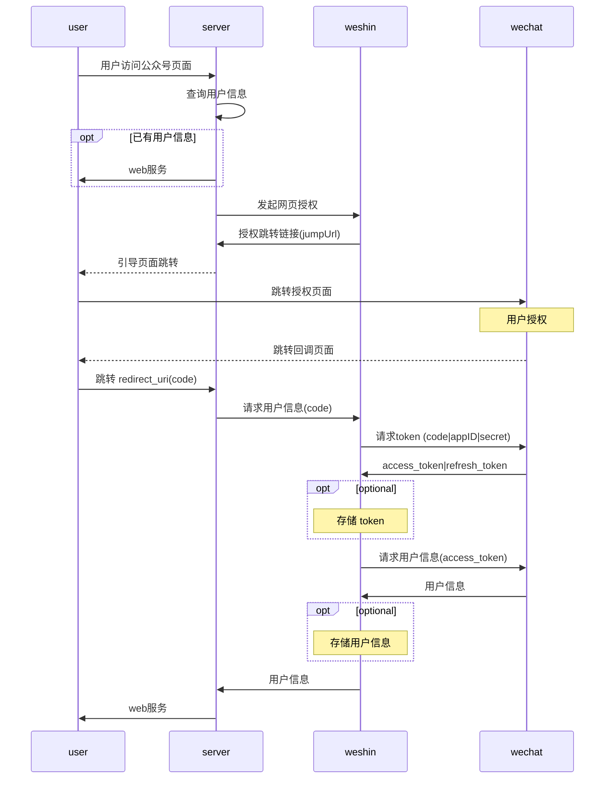

```mermaid
sequenceDiagram
	participant user
	participant server
	participant weshin
	participant wechat
	
	user ->> server: 用户访问公众号页面
	
	server ->> server: 查询用户信息
	opt 已有用户信息
      server ->> user: web服务
	end
	
	server ->> weshin: 发起网页授权
	weshin ->> server: 授权跳转链接(jumpUrl)
	server -->> user: 引导页面跳转
	user ->> wechat: 跳转授权页面
	note over wechat: 用户授权
	wechat -->> user: 跳转回调页面
	user ->> server: 跳转 redirect_uri(code)
	server ->> weshin: 请求用户信息(code)
	weshin ->> wechat: 请求token (code|appID|secret)
	wechat ->> weshin: access_token|refresh_token
	opt optional
        note over weshin: 存储 token
    end
	weshin ->> wechat: 请求用户信息(access_token)
	wechat ->> weshin: 用户信息
    opt optional
        note over weshin: 存储用户信息
    end
	weshin ->> server: 用户信息
	server ->> user: web服务	
```

