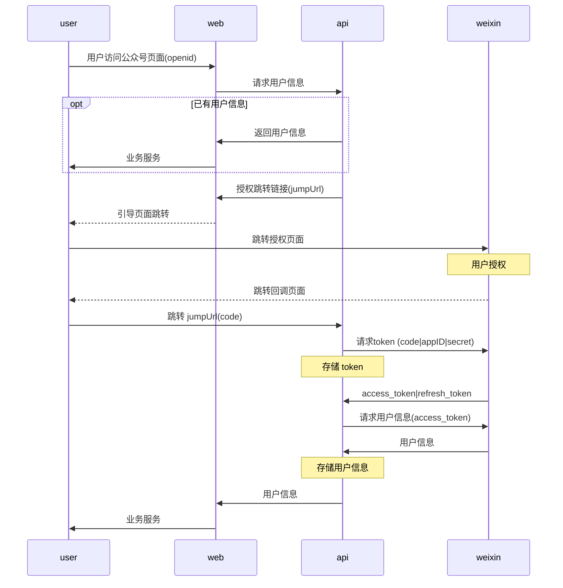

针对微信公众号授权流程，`weshin` 对应 api 层，封装获取用户信息的过程。

```mermaid
sequenceDiagram
	participant user
	participant web
	participant api
	participant weixin
	
	user ->> web: 用户访问公众号页面(openid)
	web ->> api: 请求用户信息
	opt 已有用户信息
      api ->> web: 返回用户信息
      web ->> user: 业务服务
	end
	
	api ->> web: 授权跳转链接(jumpUrl)
	web -->> user: 引导页面跳转
	user ->> weixin: 跳转授权页面
	note over weixin: 用户授权
	weixin -->> user: 跳转回调页面
	user ->> api: 跳转 jumpUrl(code)
	api ->> weixin: 请求token (code|appID|secret)
	note over api: 存储 token
	weixin ->> api: access_token|refresh_token
	api ->> weixin: 请求用户信息(access_token)
	weixin ->> api: 用户信息
	note over api: 存储用户信息
	api ->> web: 用户信息
	web ->> user: 业务服务
	
	
```

