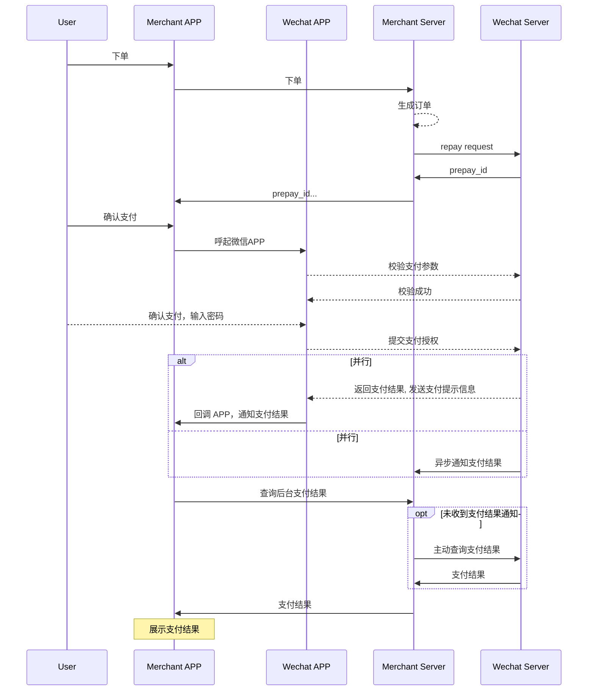

APP 支付流程

```mermaid
sequenceDiagram
    participant user as User
    participant app as Merchant APP
    participant wxapp as Wechat APP
    participant mer as Merchant Server
    participant wx as Wechat Server

    user ->> app: 下单
    app ->> mer: 下单
    mer -->> mer: 生成订单
   	mer ->> wx:  repay request
	wx ->> mer: prepay_id
	mer ->> app: prepay_id...

    user ->> app: 确认支付
    app ->> wxapp: 呼起微信APP
    wxapp -->> wx: 校验支付参数
    wx -->> wxapp: 校验成功
	user -->> wxapp: 确认支付，输入密码
	wxapp -->> wx: 提交支付授权
	
	alt 并行
		wx -->> wxapp: 返回支付结果, 发送支付提示信息
	    wxapp ->> app: 回调 APP，通知支付结果
	else 并行
        wx ->> mer: 异步通知支付结果
    end
	
    app ->> mer: 查询后台支付结果

    opt 未收到支付结果通知
        mer ->> wx: 主动查询支付结果
        wx ->> mer: 支付结果
    end
    mer ->> app: 支付结果

    Note over app: 展示支付结果
    
```