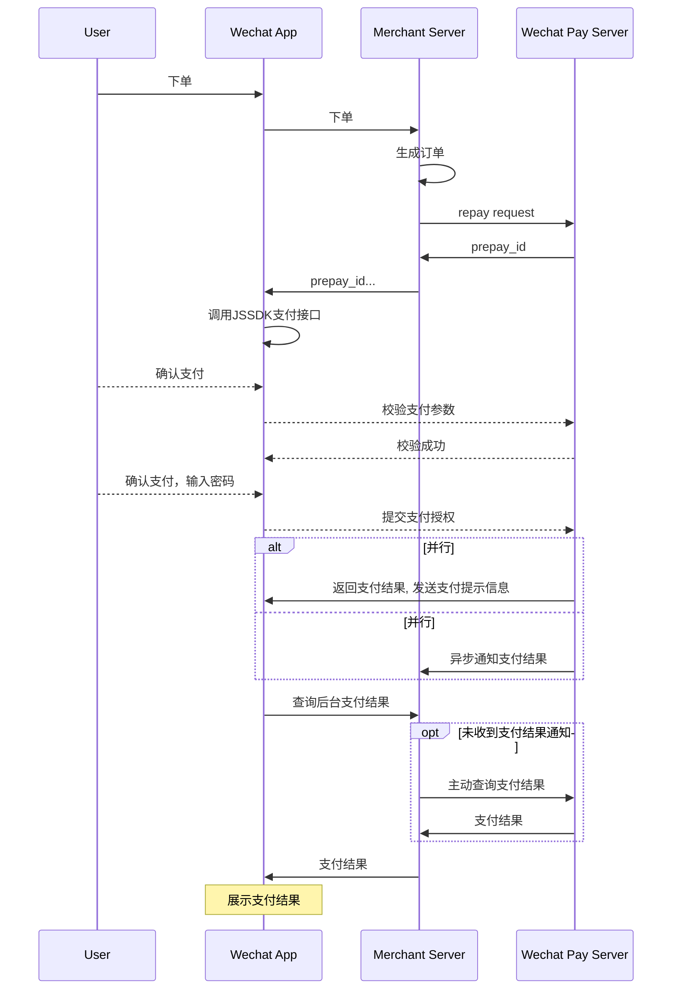

微信网页支付 (JSPay) 流程

```mermaid
sequenceDiagram
	participant user as User
	participant app as Wechat App
	participant mer as Merchant Server
	participant wx as Wechat Pay Server
	
	user ->> app: 下单
	app ->> mer: 下单
	mer ->> mer: 生成订单
	mer ->> wx:  repay request
	wx ->> mer: prepay_id
	mer ->> app: prepay_id...
	app ->> app: 调用JSSDK支付接口
	
	user -->> app: 确认支付
	app -->> wx: 校验支付参数
	wx -->> app: 校验成功
	user -->> app: 确认支付，输入密码
	app -->> wx: 提交支付授权
	
	alt 并行
		wx ->> app: 返回支付结果, 发送支付提示信息
	else 并行
        wx ->> mer: 异步通知支付结果
    end
	
    app ->> mer: 查询后台支付结果

    opt 未收到支付结果通知
        mer ->> wx: 主动查询支付结果
        wx ->> mer: 支付结果
    end
    mer ->> app: 支付结果

    Note over app: 展示支付结果
	
```

