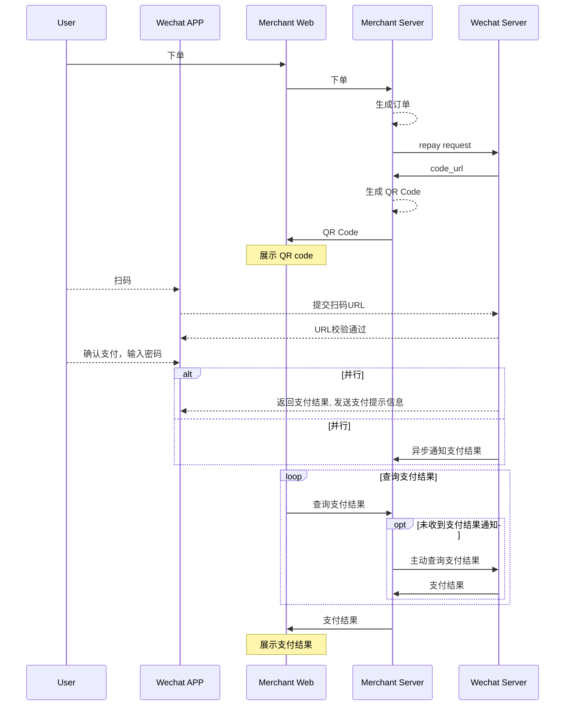

扫码支付流程

```mermaid
sequenceDiagram
    participant user as User
    participant app as Wechat APP
    participant web as Merchant Web
    participant mer as Merchant Server
    participant wx as Wechat Server

    user ->> web: 下单
    web ->> mer: 下单
    mer -->> mer: 生成订单
	mer ->> wx:  repay request
	wx ->> mer: code_url
    mer -->> mer: 生成 QR Code
    mer ->> web: QR Code
    Note over web: 展示 QR code

    user -->> app: 扫码
    app -->> wx: 提交扫码URL
    wx -->> app: URL校验通过
    user -->> app: 确认支付，输入密码

    alt 并行
		wx -->> app: 返回支付结果, 发送支付提示信息
	else 并行
        wx ->> mer: 异步通知支付结果
    end

    loop 查询支付结果
        web ->> mer: 查询支付结果
        opt 未收到支付结果通知
            mer ->> wx: 主动查询支付结果
            wx ->> mer: 支付结果
        end
    end
	
	mer ->> web: 支付结果
    Note over web: 展示支付结果
```